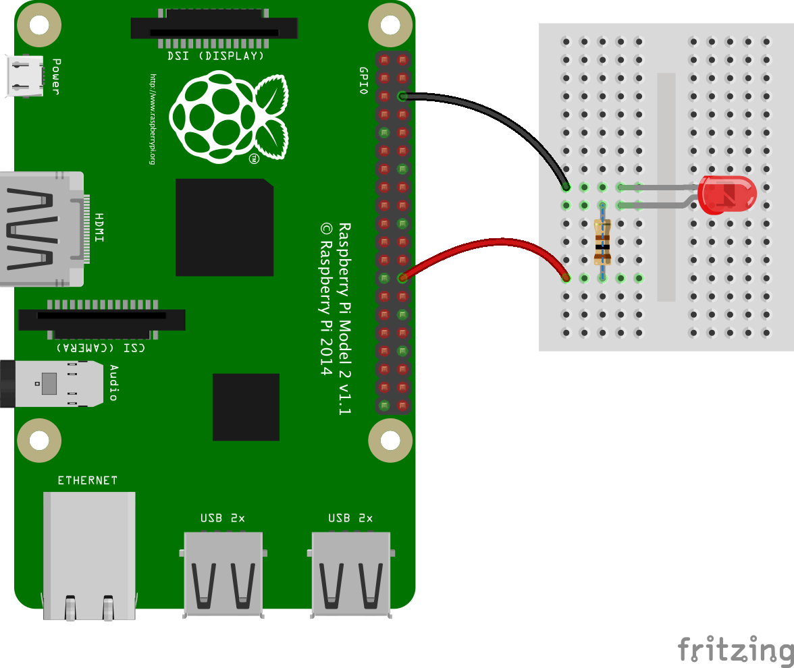

  
# Sample scripts for nodejs on the Raspberry PI
This project is gathering scripts based on several `nodejs` modules: [`serialport`](https://www.npmjs.com/package/serialport), [`onoff`](https://www.npmjs.com/package/onoff) and [`i2c-bus`](https://www.npmjs.com/package/i2c-bus)

---
_Attention!_ :
The `nodejs` modules used here seem to require the ARMv7 instruction set. To visualize that on your RPi, type at the command prompt 
```
 $> uname -a
 Linux raspberrypi3 4.4.11-v7+ #888 SMP Mon May 23 20:10:33 BST 2016 armv7l GNU/Linux
```
I was not able to have that working on Raspberry PI A or Zero, unlike the Java counterpart of this project...

---

_Note_ : Demos are using the [`websocket`](https://www.npmjs.com/package/websocket) module, installed as well during the `npm install` mentioned below.  This is only for the demos to work, this  module is not mandatory for the interaction with the sensors and other devices.

This goal is to provide a JavaScript access to sensors, PCBs and other devices hooked up on a Raspberry PI, 
like the code of [this project](https://github.com/OlivierLD/raspberry-pi4j-samples/) is doing for Java and other JVM-aware languages.

| Note  |
|---|
|  The Internet Of Things (IoT) is extensively using services (REST services are among the most popular). NodeJS provides all kind of modules, many of them will allow you to talk REST fluently. Bridging sensor data with an IoT server becomes a piece of cake. See the `Swagger` directory of this project for more details. |

### First installation
We assume you have already installed `nodejs` and `npm` on the Raspberry PI.
```
 $> node -v
 v5.11.1
 $> npm -v
 3.8.6
 $>
```
After cloning this repository on the RaspberryPI, run the following command from the root directory 
of the project (the one containing `package.json`):
```
 $> npm install
```
This will install the required nodejs modules.

### Simple GPIO interaction
This can be used to drive an led, a relay, etc.
See the source in `switch.js`.
To run a test script:
```
 $> node testSwitch.js
 Ctrl+C to stop
 Switch on pin: 7
 Switching off
 Switching on
 Switching off
 Switching on
 Switching off
 Switching on
 Switching off
 Switching on
 ...
```
This will turn the pin (#26, GPIO_07 in the `testSwitch.js` code) on and off, every second, for 100 seconds (one minute and forty seconds).
The wiring corresponding to the code is done as follow:


### MCP3008. Analog to Digital Converter with SPI interface.
The source is in `mcp3008.js`.
To run a test script:
```
 $> node testMcp3008.js
 Usage: node /home/pi/node.pi/testMcp3008.js [debug]
 Ctrl+C to stop
 Reading MCP3008: CLK: 18 MISO: 23 MOSI: 24 CS: 25
 Val:599
 Val:600
 Val:601
 Val:601
 Val:600
 Val:600
 Val:815
 Val:967
 Val:972
 ...
```
The pin numbers are always something, depending on the framework you are using (PI4J, WiringPI, onoff, etc).
The wiring corresponding to the code is that one:


### I2C BME280 (Pressure, Humidity, Temperature, Altitude)
The source is in `bme280.js`.
To run a test script:
```
 $> sudo node testBme280.js
 Init...
 Temperature : 22.21°C
 Humidity    : 61.11 %
 Pressure    : 1017.17 hPa
 --------------------------------
 Temperature : 22.21°C
 Humidity    : 61.11 %
 Pressure    : 1017.15 hPa
 --------------------------------
 Temperature : 22.21°C
 Humidity    : 61.10 %
 Pressure    : 1017.17 hPa
 --------------------------------
 ...
```
_Note_: The `BME280` provides `I2C` and `SPI` accesses. Here we use `I2C`. Make sure you connect the BME280's `SCK` to the Raspberry's `SCL` (like pin #5),
and the BME280's `SDI` to the Raspberry's `SDA` (like pin #3).

### Read GPS data, through a Serial port
See the code in `SerialReader.js` and `NMEAParser.js`.
To run a test script:
```
 $> sudo node testGPS.js
  To stop: Ctrl-C, or enter "quit" + [return] here in the console
  Usage: node /home/pi/node.pi/testGPS.js [raw]|fmt
  Serial /dev/ttyUSB0 br 4800
  Port open
  $GPGSA,A,3,20,21,15,13,10,29,,,,,,,2.3,1.5,1.8*33
  $GPGSA,A,3,20,21,15,13,10,29,,,,,,,2.3,1.5,1.8*33
  $GPGSA,A,3,20,21,15,13,10,29,,,,,,,2.3,1.5,1.8*33
  $GPRMC,013948.158,A,3744.9324,N,12230.4161,W,000.0,102.9,130816,,,A*78
  $GPRMC,013948.158,A,3744.9324,N,12230.4161,W,000.0,102.9,130816,,,A*78
  $GPRMC,013948.158,A,3744.9324,N,12230.4161,W,000.0,102.9,130816,,,A*78
  $GPGGA,013949.158,3744.9324,N,12230.4161,W,1,06,1.5,-21.4,M,,,,0000*07
  $GPGGA,013949.158,3744.9324,N,12230.4161,W,1,06,1.5,-21.4,M,,,,0000*07
  $GPGGA,013949.158,3744.9324,N,12230.4161,W,1,06,1.5,-21.4,M,,,,0000*07
  $GPGSA,A,3,20,21,15,13,10,29,,,,,,,2.3,1.5,1.8*33
  $GPGSA,A,3,20,21,15,13,10,29,,,,,,,2.3,1.5,1.8*33
  $GPGSA,A,3,20,21,15,13,10,29,,,,,,,2.3,1.5,1.8*33
  $GPRMC,013949.158,A,3744.9324,N,12230.4161,W,000.0,102.9,130816,,,A*79
  $GPRMC,013949.158,A,3744.9324,N,12230.4161,W,000.0,102.9,130816,,,A*79
  $GPRMC,013949.158,A,3744.9324,N,12230.4161,W,000.0,102.9,130816,,,A*79
  $GPGGA,013950.158,3744.9325,N,12230.4161,W,1,06,1.5,-21.5,M,,,,0000*0F
  $GPGGA,013950.158,3744.9325,N,12230.4161,W,1,06,1.5,-21.5,M,,,,0000*0F
  $GPGGA,013950.158,3744.9325,N,12230.4161,W,1,06,1.5,-21.5,M,,,,0000*0F
  $GPGSA,A,3,20,21,15,13,10,29,,,,,,,2.3,1.5,1.8*33
  $GPGSA,A,3,20,21,15,13,10,29,,,,,,,2.3,1.5,1.8*33
  $GPGSA,A,3,20,21,15,13,10,29,,,,,,,2.3,1.5,1.8*33
  $GPGSV,3,1,12,20,24,056,34,21,64,070,33,15,33,055,35,13,08,036,16*74
  $GPGSV,3,1,12,20,24,056,34,21,64,070,33,15,33,055,35,13,08,036,16*74
  ...
```
or
```
 $> sudo node testGPS.js fmt
 To stop: Ctrl-C, or enter "quit" + [return] her ein the console
 Usage: node /home/pi/node.pi/testGPS.js [raw]|fmt
 Serial /dev/ttyUSB0 br 4800
 Port open
 Position: { lat: 37.748895, lon: -122.506955 }
 Time: Sat Aug 13 2016 01:45:45 GMT+0000 (UTC)
 Position: { lat: 37.748895, lon: -122.506955 }
 Time: Sat Aug 13 2016 01:45:45 GMT+0000 (UTC)
 Position: { lat: 37.748895, lon: -122.506955 }
 Time: Sat Aug 13 2016 01:45:45 GMT+0000 (UTC)
 Position: { lat: 37.748895, lon: -122.506955 }
 Time: Sat Aug 13 2016 01:45:46 GMT+0000 (UTC)
 Position: { lat: 37.748895, lon: -122.506955 }
 Time: Sat Aug 13 2016 01:45:46 GMT+0000 (UTC)
 Position: { lat: 37.748895, lon: -122.506955 }
 Time: Sat Aug 13 2016 01:45:46 GMT+0000 (UTC)
 ...
```

### I2C L3GD20 (Gyroscope)
See the code in `l3gd20.js`.
To run a test script:
```
 $> sudo node testL3gd20.js
    To stop: Ctrl-C
    Usage: node /home/pi/node.pi/testL3gd20.js [verbose]
    Init...
    Starting...
    Calibrating X, please do not move the sensor...
    Calibrating Y, please do not move the sensor...
    Calibrating Z, please do not move the sensor...
    >> X:0 Y:0 Z:0
    >> X:0 Y:0.7393750000000003 Z:-10.399375000000001
    >> X:-0.6216874999999997 Y:3.5393750000000006 Z:-59.189375000000005
    >> X:0 Y:0 Z:-6.383125000000001
    >> X:0.19206250000000002 Y:-1.3256249999999996 Z:8.220625
    >> X:-0.2891874999999997 Y:0 Z:0
    >> X:0 Y:-0.3368749999999996 Z:0
    >> X:-0.3154374999999998 Y:-0.22312499999999957 Z:0
    >> X:0 Y:-0.17937499999999984 Z:0
    >> X:-0.15793750000000006 Y:0 Z:0
    >> X:0.12206250000000018 Y:0.32812500000000044 Z:0
    >> X:0.1483125000000003 Y:0.4506250000000005 Z:0
    >> X:-0.4991875000000001 Y:0.5381250000000004 Z:-18.388125000000002
    >> X:-0.48168750000000005 Y:1.8068750000000007 Z:-33.306875000000005
    >> X:-0.5079374999999997 Y:2.314375000000001 Z:-35.98437500000001
    >> X:-0.6391874999999998 Y:4.633125000000001 Z:-74.904375
    >> X:3.6745625000000004 Y:6.418125000000002 Z:-97.72437500000001
    >> X:-1.0504375000000001 Y:4.886875000000001 Z:-76.313125
    >> X:-0.4904375000000001 Y:3.4868750000000004 Z:-51.760625000000005
    >> X:-0.2279374999999999 Y:1.7718750000000005 Z:-41.426875
    >> X:-0.1754374999999997 Y:4.213125000000001 Z:-67.274375
    >> X:3.7095625000000005 Y:4.554375000000001 Z:-71.150625
    >> X:4.1033125 Y:4.493125000000001 Z:-77.091875
    >> X:3.5433125000000003 Y:2.1831250000000004 Z:-49.39812500000001
    >> X:6.308312500000001 Y:2.349375 Z:-78.544375
    >> X:6.387062500000001 Y:2.751875000000001 Z:-97.356875
    >> X:6.868312500000001 Y:1.2993750000000004 Z:-80.058125
    >> X:-1.8904375 Y:3.670625000000001 Z:-27.706875000000004
    >> X:-4.217937500000001 Y:5.718125000000001 Z:-29.885625000000005
    >> X:-0.8754375000000003 Y:1.8943750000000001 Z:-36.010625000000005
    >> X:-7.936687500000001 Y:2.988125000000001 Z:19.770625000000003
    >> X:-3.3954375 Y:-6.024375 Z:67.43187500000002
    >> X:0.7170625000000004 Y:-7.958125000000001 Z:78.77187500000001
    >> X:0.5858125000000003 Y:-4.974375 Z:62.16437500000001
    >> X:-0.1404375 Y:0 Z:0
 ...
```

## Demos
Some demos are available. As `nodejs` can also be used as an HTTP Server, they will display the sensors' data in a graphical Web UI.

#### Gyroscope demo
Start the server:
```
 $> sudo node demo.gyro.js
```
And load the URL displayed in the console in a WebSocket-enable browser.

#### ADC (MCP3008) demo
Start the server:
```
 $> node demo.adc.js
```
And load the URL displayed in the console in a WebSocket-enable browser.

#### IoT demo
Requires an Adafruit-IO account.
Will feed 4 feeds:
- `onoff`, a switch
- `atm-press`, a gauge (980 - 1050)
- `air-temperature`, a gauge (-10 - 60)
- `humidity`, a gauge (0 - 100)

Connect the BME280 on the Raspberry PI, and the led (switch demo) asabove.
Start on the Raspberry PI:
```
 $> sudo node demo.iot.js <Your-Adafruit-IO-key>
```
Then you can launch `iot.one.html` in your browser.
Provide your Adafruit-IO key in the UI when prompted, and you can see the sensors data on the page.
You can also turn the switch on and off from the same page.

You can also deal with the switch from a Pebble (a smart watch), as described [here](https://github.com/OlivierLD/pebble), in the `REST.app` directory.


### To come...
 * PWM
 * FONA
 * Servo HAT
 * Sense HAT
 * IoT with Swagger and Adafruit-IO
 * ... and more

### To debug a nodejs application:
OK, `console.log` is great, but there are other ways to debug...

To do once:
```
$> [sudo] npm install -g node-inspector
```
Then
```
$> node-debug testUtils.js
Node Inspector v0.12.8
Visit http://127.0.0.1:8080/?port=5858 to start debugging.
Debugging `testUtils.js`

Debugger listening on port 5858
```

Then open Chrome, and load the URL above.
Switch to the "Sources" tab (if it is not visible yet), set your breakpoints, and begin debugging!
