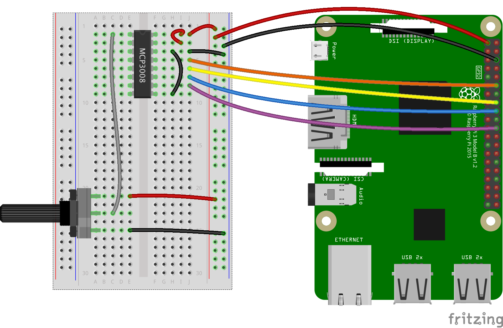

## Sample script for nodejs on the Raspberry PI

### First installation
We assume you have installed `nodejs` and `npm` on the Raspberry PI.
After cloning this repository on the RaspberryPI, run the following command from the root directory of the project
(the one containing `package.json`)
```
 $> npm install
```
This will install the required nodejs modules.

### MCP3008. Analog to Digital Converter
The source is in `mcp3008.js`.
To run a test script:
```
 $> node test_mcp3008.js
```
The wiring corresponding to the code is that one:


### To debug a nodejs application:

To do once:
$> [sudo] npm install -g node-inspector
Then
$> node-debug server.js
Node Inspector v0.12.8
Visit http://127.0.0.1:8080/?port=5858 to start debugging.
Debugging `server.js`

Debugger listening on port 5858

Then open Chrome, and load the URL above.
Switch to the "Sources" tab, set your breakpoints, and begin debugging!
